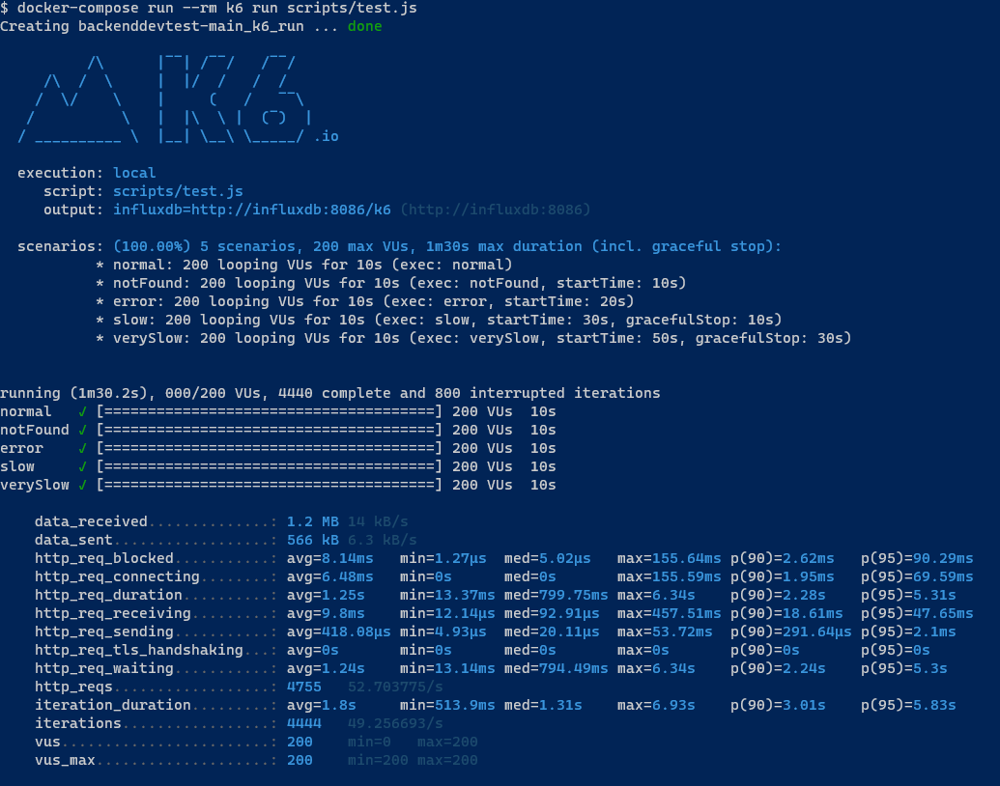

# product

Ejecutando del docker-compose se puede ejecutar la API esta en el DockerHub.

```
docker-compose up -d simulado influxdb grafana product-api
```


## Test Result


## Tecnologias
 * Java 11
 * Spring
    - WebFlux/reactor
    - OpenApi
    - Swagger
    - Lombok
